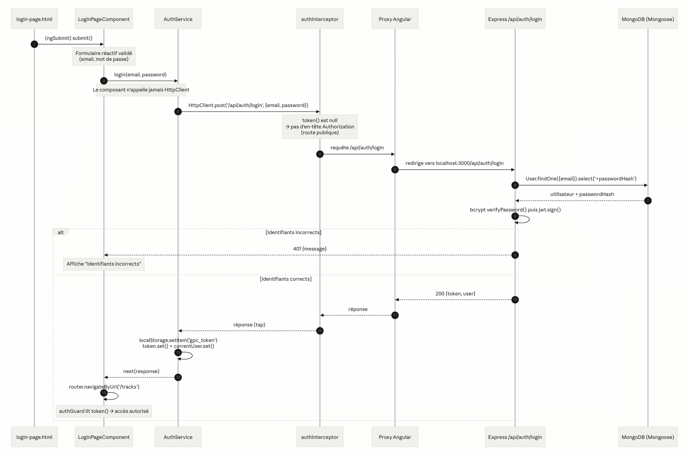
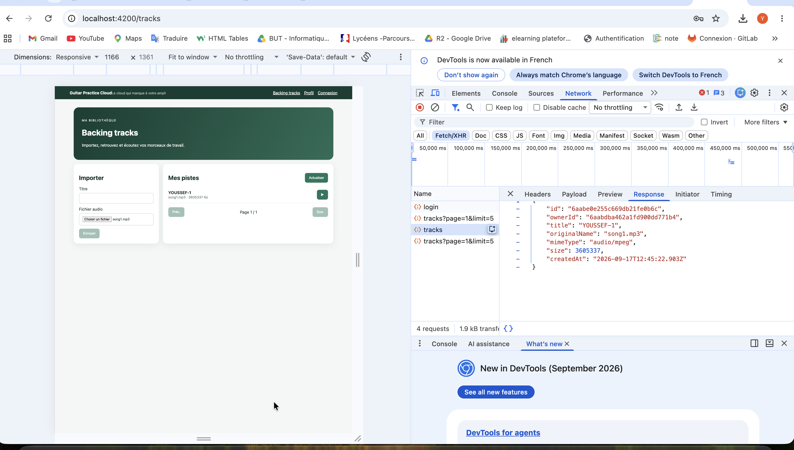
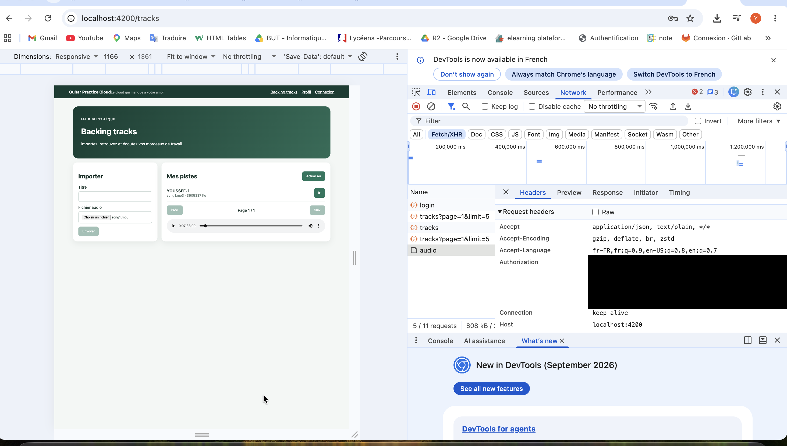
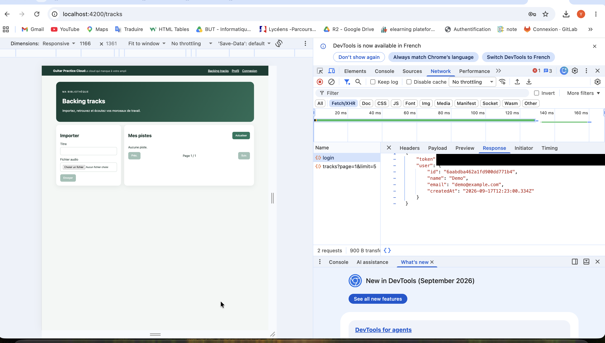
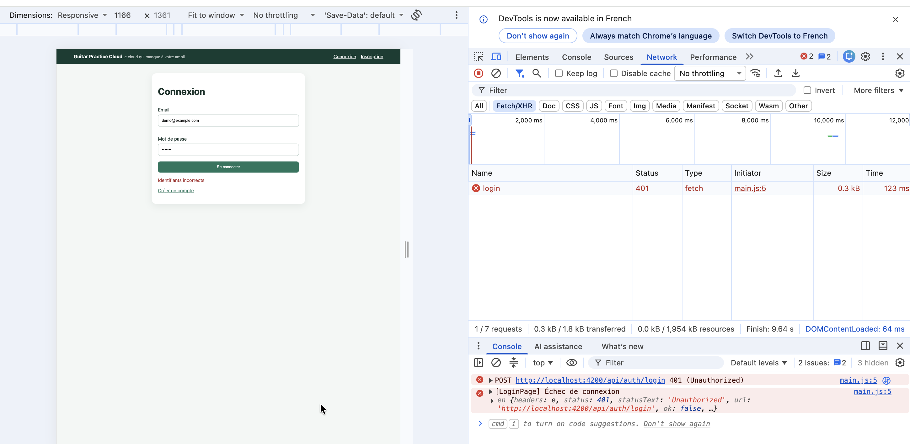
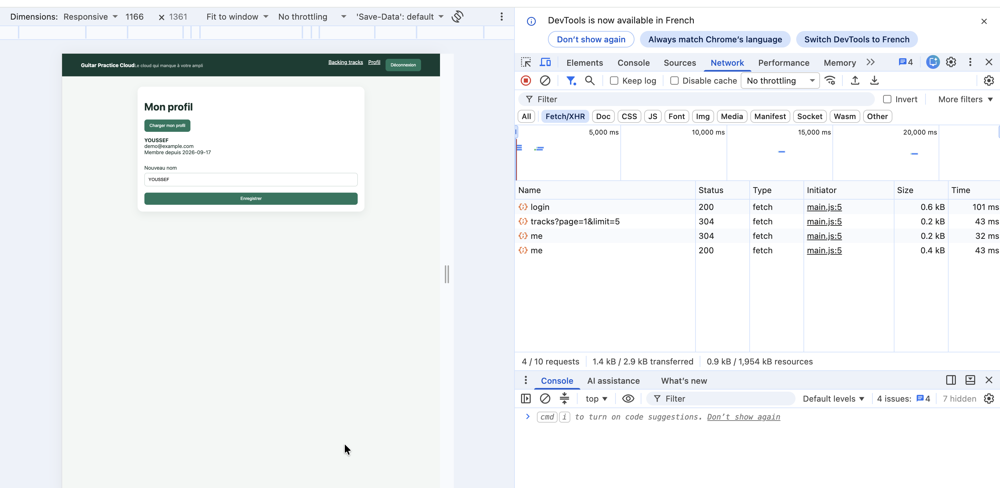
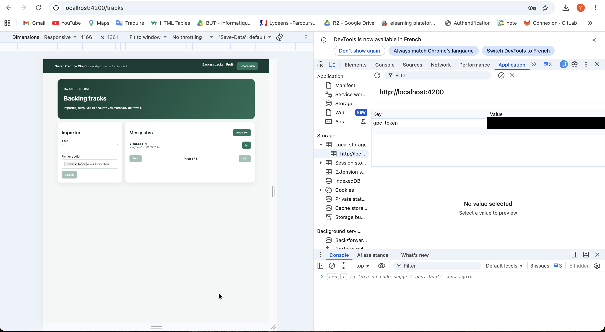
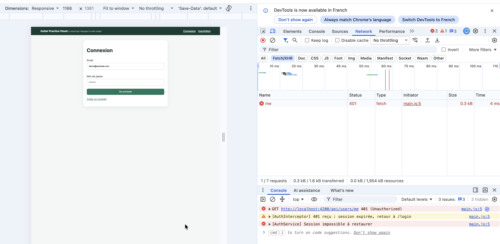
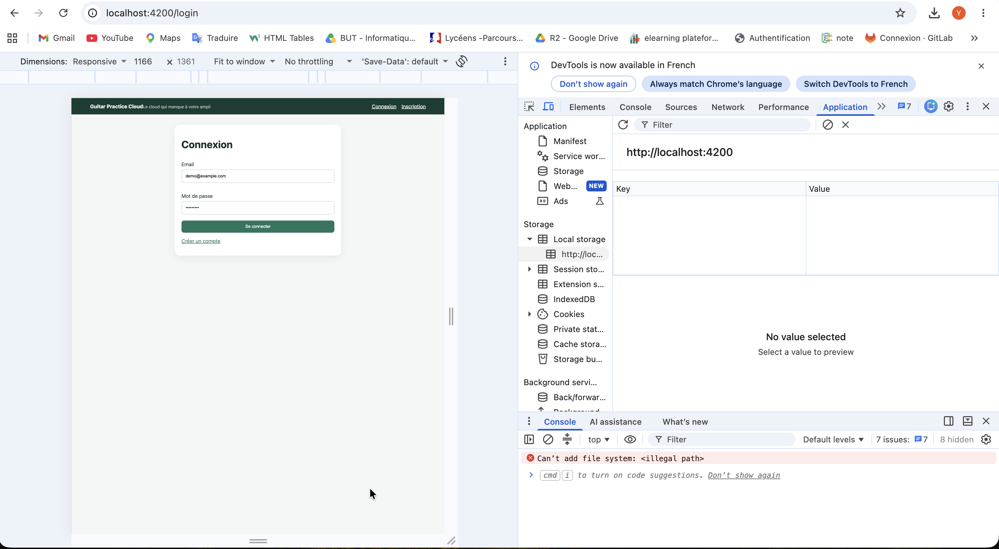

# Rapport d'usage de l'IA - TP1

TP réalisé seul (pas de binôme). Assistant utilisé : Claude Code.

Pour chaque mission, détailler et fournir des explications concernant : objectif; prompt principal; plan proposé par l'agent; vérifications réalisées par le binôme; erreurs ou propositions rejetées; fichiers effectivement modifiés; preuve de fonctionnement; ce que chaque membre sait maintenant expliquer sans l'agent.

Captures d'écran à déposer dans `screenshots/tp1/` et à lier ci-dessous avec ``.

---

## Mission 0 — Cartographie de l'application

**Objectif** : comprendre l'architecture existante (composant racine, routes publiques/protégées, HttpClient, modèles/services/pages, intercepteur JWT, guard) sans modifier le code, puis décrire le flux complet d'un clic sur « Se connecter » et lister ce qui manque pour la Mission 1.

**Prompt principal** :

```
Tu es mon assistant de développement pour ce projet Angular 22 (TP1 Guitar Practice Cloud).

1. Lis CLAUDE.md, AGENTS.md et best-practices.md, puis confirme-moi les règles que tu as prises en compte.
2. Lis ../README.md, ../API_CONTRACT.md et ../SUJET_ETUDIANT_TP1.md.
3. Analyse le code existant SANS MODIFIER AUCUN FICHIER. Ne lis pas et n'affiche jamais le contenu de ../backend/.env.

Mission 0 — Cartographie. Retrouve et cite le fichier + les lignes pour :
- le composant racine ;
- la configuration des routes (routes publiques vs protégées par le guard) ;
- l'enregistrement de HttpClient ;
- les modèles, services et pages ;
- le mécanisme qui ajoute le JWT aux requêtes protégées ;
- le guard et ce qu'il fait quand il n'y a pas de token.

Ensuite :
A. Décris étape par étape le flux complet d'un clic sur "Se connecter" (template → composant →
   AuthService → HttpClient → intercepteur → proxy Angular → POST /api/auth/login (backend) →
   MongoDB → réponse → stockage du token → Signal currentUser → redirection), avec un schéma Mermaid.
B. Classe les routes de API_CONTRACT.md en publiques / protégées.
C. Dis précisément, fichier par fichier, ce qui est déjà implémenté et ce qui MANQUE pour la Mission 1.

Ne propose pas encore de code. Attends ma validation.
```

**Ce que l'IA m'a répondu (résumé)** :

- Elle m'a d'abord confirmé les règles du projet qu'elle allait respecter (Angular 22, `inject()`, Signals, formulaires réactifs, ne jamais toucher au backend ni au `.env`).
- Elle m'a fait un tableau avec, pour chaque élément demandé, le fichier et les lignes : composant racine (`app.ts`), routes (`routes.ts`), HttpClient (`main.ts`), intercepteur (`auth.interceptor.ts`), guard (`auth.guard.ts`).
- Elle m'a décrit le chemin complet d'un clic sur « Se connecter », du formulaire jusqu'à MongoDB et retour, avec un schéma.
- Elle a classé les routes de l'API : publiques (`/health`, `/auth/register`, `/auth/login`) et protégées par le token (`/users/me`, `/tracks`...).
- Elle m'a listé ce qui manquait pour la Mission 1.

**Ce que j'ai vérifié moi-même** : j'ai ouvert chaque fichier cité pour voir si les lignes correspondaient bien au code. J'ai lancé le backend et le front, et j'ai suivi une connexion dans l'onglet Network de Chrome pour voir la requête `POST /api/auth/login` et sa réponse. À partir de ça, j'ai refait le schéma du flux de connexion (ci-dessous).

**Erreurs ou propositions rejetées** : aucune, je lui avais demandé de ne pas écrire de code pour cette mission, juste d'analyser.

**Fichiers modifiés** : aucun.

**Preuves** :

Schéma du flux de connexion :



En explorant l'application, j'ai aussi testé l'ajout d'une piste et la lecture audio. On voit que le token est bien envoyé dans le header `Authorization` (je l'ai masqué) :





**Ce que je sais expliquer sans l'IA** :
- Le chemin d'une connexion : le formulaire appelle le composant, qui appelle `AuthService`, qui envoie la requête au backend. Le backend vérifie le mot de passe dans MongoDB et renvoie un token.
- La différence entre une route publique et une route protégée : sur une route protégée, il faut envoyer le token sinon le backend répond 401.
- Le rôle du guard : il empêche d'aller sur Profil ou Tracks si on n'a pas de token.
- Le rôle de l'intercepteur : il ajoute automatiquement le token à chaque requête.

---

## Mission 1 — Inscription, connexion et profil

**Objectif** : finir toute la partie compte utilisateur : inscription, connexion, profil, déconnexion, et gérer le cas où le token n'est plus valide.

**Ce qui était déjà fait avant** : les formulaires de connexion et d'inscription, les appels à l'API via `AuthService`, le token stocké dans le localStorage, la redirection après connexion, la barre de navigation qui change quand on est connecté, le bouton de déconnexion et la modification du nom sur la page Profil.

**Prompt principal** : j'ai donné à l'IA un fichier récapitulatif de ma session précédente, avec la liste des 5 choses qui restaient à faire, et je lui ai demandé : « lis le fichier handoff_claude pour avoir une idée et finir mon tp1 ».

**Ce que l'IA a fait** :
1. Mot de passe d'au moins 8 caractères à l'inscription (le backend l'exige déjà, donc le front vérifie la même chose avant d'envoyer).
2. Nom d'au moins 2 caractères (inscription et profil).
3. Un message d'erreur sous chaque champ (« Le mot de passe est obligatoire », « au moins 8 caractères »...). Si le formulaire n'est pas bon, la requête n'est pas envoyée.
4. Quand on recharge la page, le profil revient tout seul : au démarrage, s'il y a un token, l'app redemande le profil avec `GET /api/users/me`.
5. Si le backend répond 401 (token expiré ou modifié), on est déconnecté et renvoyé vers la page de connexion. Sauf sur la page de connexion elle-même, où un 401 veut juste dire « mauvais mot de passe ».

**Erreurs ou propositions rejetées** : l'IA a codé les 5 correctifs d'un coup sans attendre que je valide son plan. Je l'ai arrêtée et je lui ai demandé de m'expliquer chaque changement un par un. Ensuite j'ai testé chaque correctif moi-même dans le navigateur avant de le garder. Avant de mettre mes captures dans le rapport, l'IA m'a signalé que certaines montraient mon token (et une autre mes identifiants MongoDB Atlas) : les tokens ont été masqués et la capture Atlas n'a pas été ajoutée au projet.

**Ce que j'ai vérifié moi-même** :
- Inscription : si je clique dans le mot de passe et que je sors sans rien taper, j'ai « obligatoire ». Avec « abc », j'ai le message des 8 caractères. Avec « abcdefgh », le message disparaît. Avec un formulaire vide, aucune requête ne part dans Network.
- Connexion avec un mauvais mot de passe : 401 dans Network et le message « Identifiants incorrects » s'affiche, je reste sur la page.
- Connexion avec le compte démo : 200, je suis redirigé vers les tracks.
- Rechargement (Cmd + R) sur la page Profil : une requête `me` part toute seule et mon profil reste affiché sans cliquer sur « Charger mon profil ».
- J'ai modifié le token à la main dans Application > Local Storage, puis j'ai cliqué « Charger mon profil » : 401, je suis renvoyé vers la connexion et le token est supprimé.
- Déconnexion : le localStorage est vide et le menu repasse à Connexion / Inscription.

**Fichiers modifiés** : `main.ts`, `auth.service.ts`, `auth.interceptor.ts`, et les pages `login-page`, `register-page`, `profile-page`, `app` (html + ts).

**Preuves** :

Connexion réussie (200). La réponse contient le token (masqué) et l'utilisateur :



Connexion refusée (401), le message d'erreur s'affiche :



Page Profil : `GET /api/users/me` au rechargement, puis modification du nom :



Le token est rangé dans le localStorage sous le nom `gpc_token` (valeur masquée) :



Token modifié à la main : 401, déconnexion et retour à la page de connexion :



Après déconnexion, le localStorage est vide :



**Ce que je sais expliquer sans l'IA** :
- Pourquoi on vérifie le formulaire côté Angular alors que le backend le fait déjà : côté Angular c'est pour que l'utilisateur voie l'erreur tout de suite. Mais on ne peut pas enlever la vérification du backend, parce que le front peut être contourné (avec F12 ou en envoyant la requête directement).
- La différence entre Signal et localStorage (voir ci-dessous).
- Le rôle de l'intercepteur : il colle le token sur chaque requête, et quand le backend répond 401 il déconnecte l'utilisateur.
- Pourquoi on ne déconnecte pas sur un 401 de la page de connexion : sinon le message « Identifiants incorrects » ne s'afficherait jamais.
- La différence entre le guard et l'intercepteur : le guard vérifie juste qu'il y a un token avant d'ouvrir une page, c'est le backend qui dit si le token est encore valide.
- Où se fait la mise à jour du profil : côté front dans `profile-page.ts` puis `AuthService.update()` qui envoie `PUT /api/users/me`, côté back dans la route `PUT /users/me` de `app.js`.

**Différence entre Signal et localStorage** :
Le localStorage est un espace de stockage du navigateur : ce qu'on y met reste même si on recharge la page ou qu'on ferme l'onglet, mais l'affichage ne se met pas à jour tout seul quand il change. Un Signal, c'est une variable Angular en mémoire : dès que sa valeur change, tout ce qui l'affiche se met à jour automatiquement, mais elle est remise à zéro quand on recharge la page. Dans le projet, j'utilise les deux : le token est dans le localStorage pour rester connecté après un rechargement, et l'utilisateur connecté est dans le Signal `currentUser` pour que le menu et la page Profil se mettent à jour. Comme le Signal est vidé au rechargement, l'app redemande le profil au backend au démarrage.
