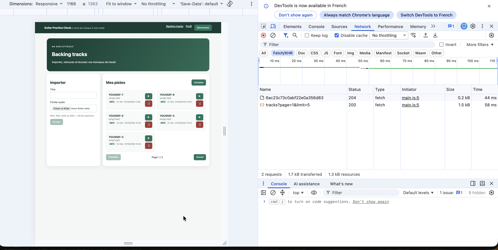
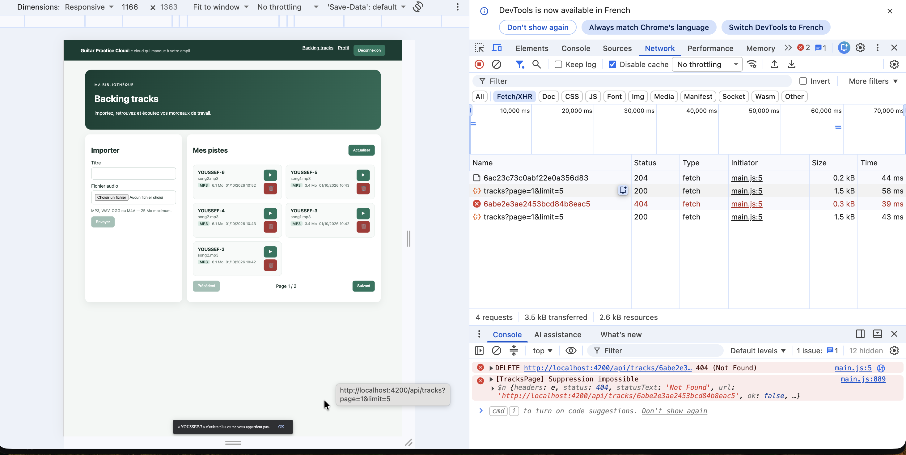
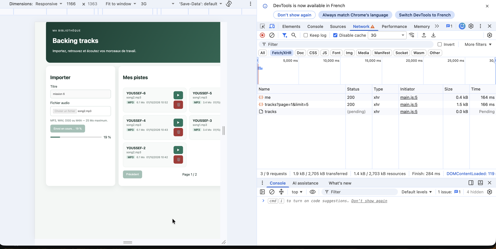

# Rapport d'usage de l'IA - TP3

TP réalisé seul (pas de binôme). Assistant utilisé : Claude Code (modèle Claude Opus 5.5), lancé dans le terminal, avec accès aux fichiers du projet.

Pour chaque mission : objectif, prompt principal, plan proposé par l'agent, vérifications réalisées, erreurs ou propositions rejetées, fichiers effectivement modifiés, preuve de fonctionnement, ce que je sais maintenant expliquer sans l'agent.

Captures dans `screenshots/tp3/`. Le détail technique (flux, tableaux fichier/méthode, rapport des tests) est dans `REPONSES_TP3.md`.

> Les prompts ci-dessous regroupent les consignes que j'ai données à l'agent au fil de la séance, rassemblées en une seule demande par mission.

---

## Méthode de travail

J'ai utilisé l'agent comme un assistant de développement, en gardant la main sur chaque étape :

1. **Comprendre avant de coder** : pour chaque mission, je demandais d'abord le flux complet (composant → service → HttpClient → API) et la liste des fichiers concernés.
2. **Une mission à la fois** : l'agent implémente une mission, je la teste dans le navigateur, je valide, et seulement ensuite on passe à la suivante. Comme ça, une régression est tout de suite localisée.
3. **Preuves** : je réalise moi-même les tests dans Chrome (Network, Console, throttling, plusieurs onglets) et les captures.
4. **Un commit par mission validée**, avec un message explicite, et uniquement les fichiers de la mission.

---

## Mission 5 — Suppression d'une piste

**Objectif** : ajouter une action « Supprimer » sur chaque card, avec confirmation, anti double-clic, message SnackBar, rafraîchissement de la liste et gestion du cas où la piste n'existe plus ou n'appartient pas à l'utilisateur.

**Prompt principal** :

```
On attaque le TP3, Mission 5 (suppression d'une piste).

1. Lis SUJET_ETUDIANT_TP3.md, API_CONTRACT.md et la route DELETE /api/tracks/:id dans backend/src/app.js.
   Ne modifie pas le backend.
2. Explique-moi d'abord le flux complet : card → TracksPageComponent → TrackService → HttpClient
   → DELETE /api/tracks/:id → réponses possibles (204 / 404).
3. Ensuite implémente, en respectant les règles du projet (inject(), Signals, @if/@for) :
   - l'appel HTTP uniquement dans TrackService (jamais HttpClient dans le composant) ;
   - une confirmation avant suppression ;
   - un état de suppression qui empêche les doubles clics ;
   - un message de succès ou d'erreur avec le SnackBar d'Angular Material ;
   - le rechargement de la page après suppression ;
   - le cas 404 : piste déjà supprimée (autre onglet) ou qui ne m'appartient pas.
4. Vérifie que le build passe, puis dis-moi quoi tester dans le navigateur.
```

**Plan proposé par l'agent** :
1. Ajouter `remove(id)` dans `TrackService`.
2. Dans le composant : `confirm()`, un signal `deletingId`, `finalize` pour le remettre à zéro dans tous les cas, `MatSnackBar` pour les messages, `load()` pour recharger.
3. Cas `404` : message dédié et rechargement de la liste, qui n'est plus à jour.
4. Installer Angular Material (absent du projet) et son thème.

**Ce que j'ai vérifié moi-même** :
- Suppression normale : `DELETE` → `204` dans Network, SnackBar affiché, liste rechargée.
- Annulation de la confirmation : aucune requête envoyée.
- Cas concurrent : appli ouverte dans deux onglets, piste supprimée dans le premier, puis suppression de la même piste dans le second. Résultat : `404`, SnackBar « … n'existe plus ou ne vous appartient pas », et la liste se met à jour.

**Erreurs ou propositions rejetées / corrigées** :
- Sur ma capture du cas `404`, la console affichait une erreur rouge alors que ce cas est **prévu et géré**. Comme le sujet demande « aucune erreur inattendue dans la console », j'ai fait passer ce message en `console.warn`. La seule ligne rouge restante est celle que Chrome affiche lui-même pour toute réponse `404`.
- Cas limite ajouté : quand on supprime la dernière piste d'une page, celle-ci devient vide (le backend ne corrige pas le numéro de page). L'application recule alors automatiquement à la dernière page existante.
- La ligne d'analytics ajoutée automatiquement par Angular CLI dans `angular.json` a été laissée hors des commits : elle ne concerne pas le TP.

**Fichiers modifiés** : `track.service.ts`, `tracks-page.ts`, `tracks-page.html`, `tracks-page.css`, `styles.css` (thème Material), `package.json` / `package-lock.json` (`@angular/material`, `@angular/cdk`).

**Preuves** :

Suppression réussie (`DELETE` → `204`, puis rechargement `tracks?page=1&limit=5`) :



Piste déjà supprimée dans un autre onglet (`404` + SnackBar + rechargement) :



**Ce que je sais expliquer sans l'IA** :
- Pourquoi l'appel passe par `TrackService` : l'URL est définie à un seul endroit, réutilisable et testable seule ; le composant ne gère que l'affichage.
- Pourquoi le guard et le bouton ne sécurisent pas la suppression : un `DELETE` peut être envoyé avec curl. La vraie protection est côté backend : le middleware `auth` vérifie le JWT (sinon `401`), puis `findOneAndDelete({ _id, ownerId })` ne supprime que les pistes de l'utilisateur (sinon `404`).
- Pourquoi une piste supprimée et une piste d'un autre utilisateur donnent le même `404`, ce qui évite en plus de révéler l'existence de la piste.
- Le rôle de `deletingId` (anti double-clic) et de `finalize` (remise à zéro en cas de succès comme d'erreur).

---

## Mission 6 — Progression de l'upload

**Objectif** : afficher le pourcentage pendant l'envoi, distinguer les états « aucun upload », « en cours », « réussi » et « échec », et bloquer les contrôles pendant l'envoi.

**Prompt principal** :

```
Mission 6 : progression de l'upload.

- Utilise les événements HTTP d'Angular (pas de simulation) pour afficher un pourcentage réel.
- Distingue au minimum 4 états : aucun upload, en cours avec %, réussite, échec.
- Pendant l'envoi : désactive le titre, le champ fichier et le bouton, et empêche une seconde soumission.
- Ne journalise jamais le mot de passe ni le JWT.
- Garde le contrat HTTP existant (POST /api/tracks, multipart audio + title) et l'appel dans TrackService.
- Explique-moi pourquoi une requête avec progression ne se traite pas comme une requête
  qui émet uniquement sa réponse finale, puis dis-moi comment le vérifier dans Network.
```

**Plan proposé par l'agent** :
1. `TrackService.upload()` avec `reportProgress: true` et `observe: 'events'`.
2. Un état `uploadState` (`idle` / `uploading` / `success` / `error`) et un signal `progress` ; `uploading` devient un `computed`.
3. Dans le `next`, un traitement selon `event.type` : `UploadProgress` → pourcentage, `Response` → succès.
4. Une barre `<progress>` accessible, et les contrôles désactivés pendant l'envoi.

**Problème technique identifié** : `HttpClient` utilise **`fetch` par défaut** dans Angular 22, et `fetch` ne gère pas la progression d'envoi : Angular lève l'erreur « The FetchBackend does not support upload progress reporting ». C'était cohérent avec Network, qui affichait le type `fetch` sur mes requêtes. La solution a été d'ajouter `withXhr()` dans `main.ts`.

**Ce que j'ai vérifié moi-même** :
- En local, l'envoi est instantané. J'ai donc simulé une connexion lente avec le **throttling 3G** de Chrome et envoyé un fichier de 6,1 Mo.
- La barre progresse (capture à 19 %), le bouton affiche « Envoi en cours… 19 % », le titre et le champ fichier sont désactivés.
- Dans Network, la requête `tracks` est en `pending` et de type **`xhr`** : c'est la confirmation que `withXhr()` est bien actif.

**Erreurs ou propositions rejetées / corrigées** :
- Une première version de la documentation affirmait que `fetch` était utilisé par défaut « depuis Angular 21 ». Ce n'était vérifié que sur la version du projet. La phrase a été corrigée en « Dans Angular 22 (version du projet) », pour ne garder que ce qui a été constaté.
- Le pourcentage n'est calculé que si `event.total` est connu, pour ne jamais afficher une valeur fausse.

**Fichiers modifiés** : `main.ts`, `track.service.ts`, `tracks-page.ts`, `tracks-page.html`, `tracks-page.css`.

**Preuve** :

Upload en cours avec throttling 3G : barre à 19 %, contrôles désactivés, requête `tracks` en `pending` de type `xhr` :



**Ce que je sais expliquer sans l'IA** :
- Une requête classique émet une seule valeur (la réponse). Avec `observe: 'events'`, la même requête émet une suite d'événements (`Sent`, `UploadProgress`… puis `Response`). Le traitement dépend donc de `event.type`, et le succès n'est connu qu'au dernier événement.
- Le calcul : `Math.round(100 × loaded ÷ total)`. Par exemple, 3 Mo sur 6 Mo donne 50 %.
- Pourquoi `withXhr()` : `XMLHttpRequest` expose `xhr.upload` et ses événements de progression, `fetch` non.
- Les 4 états, et pourquoi les contrôles sont bloqués pendant l'envoi.

---

## Mission 7 — Tests automatisés

**Objectif** : écrire au moins 3 tests frontend qui vérifient les URL, méthodes, paramètres, headers et résultats, sans dépendre du backend ni de MongoDB.

**Prompt principal** :

```
Mission 7 : tests automatisés frontend.

- Vérifie d'abord l'outillage de test présent (vitest, builder Angular, tsconfig) et ce qui manque.
- Écris au moins 3 tests ciblés parmi la liste du sujet, en priorité :
  TrackService.list() (page et limit), AuthService.login() (méthode, URL, corps),
  l'intercepteur (header Authorization avec et sans token) et le guard (redirection sans token).
- Aucun test ne doit dépendre du backend ou de MongoDB : réponses HTTP simulées uniquement.
- Chaque test doit contenir des assertions utiles (URL, méthode, paramètres, headers, résultat).
- Les tests ne doivent pas être inclus dans le build de l'application.
- Lance npm test et npm run build, et prouve qu'un test échoue bien si le code est cassé.
```

**Plan proposé par l'agent** :
1. Constat : `vitest` est présent, mais il n'y a ni fichier de test, ni `tsconfig.spec.json`, ni `jsdom`.
2. Mise en place : `jsdom`, `tsconfig.spec.json`, exclusion des tests dans `tsconfig.app.json`.
3. Tests avec `provideHttpClientTesting()` et `HttpTestingController`, plus `http.verify()` après chaque test.

**Problèmes rencontrés et corrigés** :
- Premier `npm test` : erreur « Configuration 'development' for target 'build' … is not set ». Correction : `"buildTarget": "gpc:build"` dans la cible `test` de `angular.json`.
- Seul ce changement d'`angular.json` a été commité, sans la ligne d'analytics locale.

**Vérifications réalisées** :
- `npm test` : `Test Files 4 passed (4)`, `Tests 7 passed (7)`.
- `npm run build` : OK, les fichiers de test ne sont pas embarqués dans l'application.
- **Test de mutation manuel** : en retirant volontairement `page` des paramètres de `TrackService.list()`, le test correspondant échoue (`expected null to be '2'`). Une fois le code rétabli, les 7 tests repassent. Cela prouve que les tests détectent réellement une régression.

**Fichiers créés ou modifiés** :
- Tests : `shared/services/track.service.spec.ts`, `shared/services/auth.service.spec.ts`, `shared/interceptors/auth.interceptor.spec.ts`, `shared/guards/auth.guard.spec.ts`
- Configuration : `tsconfig.spec.json` (nouveau), `tsconfig.app.json`, `tsconfig.json`, `angular.json` (cible `test`), `package.json` / `package-lock.json` (`jsdom`)

**Preuve** : rapport des tests (attendu / observé) dans `REPONSES_TP3.md`, section « Mission 7 ».

| Test | Vérifie |
|---|---|
| `TrackService.list(2, 5)` | `GET /api/tracks` avec `page=2` et `limit=5` |
| `TrackService.remove('abc123')` | `DELETE /api/tracks/abc123` |
| `AuthService.login()` | `POST /api/auth/login` avec `{ email, password }` + token rangé (signal + localStorage) |
| intercepteur avec token | header `Authorization: Bearer …` présent |
| intercepteur sans token | pas de header `Authorization` |
| guard sans token | redirection (`UrlTree`) vers `/login` |
| guard avec token | accès autorisé (`true`) |

**Ce que je sais expliquer sans l'IA** :
- Pourquoi les tests HTTP n'ont pas besoin de MongoDB : `HttpTestingController` intercepte la requête, rien ne part sur le réseau. Le test vérifie la requête préparée par Angular, puis fournit la réponse avec `flush`.
- La structure d'un test : préparer (`TestBed`), agir (appel de la méthode), vérifier (`expectOne` + `expect`), répondre (`flush`).
- Ce que vérifie un test d'intercepteur (le header ajouté ou non) et un test de guard (la décision de navigation).
- La différence entre test unitaire (une pièce isolée, dépendances simulées) et test d'intégration (plusieurs vraies pièces ensemble, par exemple Angular + Express + MongoDB).
- Le rôle de `http.verify()` : aucune requête en trop, aucune requête attendue sans réponse.

---

## Vérifications finales

- `npm test` : 7 tests passent.
- `npm run build` : OK, sans erreur.
- Network : `DELETE` après confirmation (`204`, et `404` dans le cas concurrent), upload avec événements de progression (type `xhr`).
- Console : aucun mot de passe ni JWT journalisé. Le seul message rouge restant est celui que Chrome affiche lui-même pour un `404` prévu.

## Bilan sur l'usage de l'IA

- **Exiger l'explication avant le code** m'a permis de comprendre chaque mécanisme (événements HTTP, Blob, tests) avant de le valider, et de pouvoir le défendre à l'oral.
- **Vérifier dans le projet plutôt que croire une affirmation générale** : le problème `fetch` / `withXhr()` a été confirmé dans le code source d'Angular et dans l'onglet Network, et une affirmation de version non vérifiée a été corrigée.
- **Un test doit pouvoir échouer** : le test de mutation manuel est la preuve que la suite de tests a une vraie valeur.
- **Des commits propres** : un commit par mission validée, uniquement avec les fichiers concernés (ni analytics, ni `.DS_Store`).
